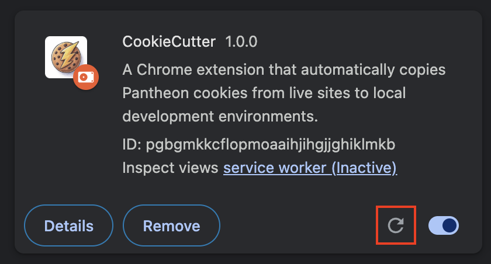

# CookieCutter 🍪⚡️

A Chrome extension that automatically copies Pantheon `X-Pantheon` cookies from live sites to local development environments.


## Installation

1. **Clone the repository**

   ```bash
   git clone https://github.com/tyrellcurry/cookieCutter.git ~/Documents/chromeExtensions/cookieCutter
   ```

   (This will store the extension at `~/Documents/chromeExtensions/cookieCutter`)

2. **Load the extension in Chrome**

   - Open Chrome and go to `chrome://extensions/`
   - Enable "Developer mode" (toggle in top-right corner)
   - Click "Load unpacked" on the top left
   - Select the `cookie-cutter-chrome-extension` folder from within: `~/Documents/chromeExtensions/cookieCutter`

3. **Done!** The extension will now automatically:
   - Capture Pantheon `X-Pantheon` cookies when you visit `*.pantheon.io` sites
   - Inject those cookies when you navigate to local development sites (localhost, 127.x.x.x, file://)

## Using The Extension

- Log into the [Pantheon Dashboard](https://dashboard.pantheon.io/) and reload the page (reload, not refresh)
- Navigate to your local development environment eg. (`localhost:3000`) and reload the page (reload, not refresh)
- Pantheon authentication cookies are now automatically applied!

Watch the demo video:

[](https://youtu.be/CtGg9PiYX8w)

## FAQs

What if I log into another Pantheon account in the live dashboard and the cookies change?

- The extension will automatically store and apply the new cookies, just follow the steps above

What if the cookies are expired and then get refreshed? Will the expired cookies stay stored?

- No, as long as you follow the steps above after the cookies are refreshed, it will use the latest cookies

Can I use this extension in incognito mode?

- Yes! Find the extension settings by navigating to `chrome://extensions/` and clicking the **Details** button within CookieCutter. From there you can enable additional settings such as allowing in incognito mode.

Will storing these cookies affect with my local storage?

- No, the cookies are stored in a specific extension storage that will not affect standard local storage

## Updates

To update the extension when a new change is made, pull from the repo:

```bash
cd ~/Documents/chromeExtensions/cookieCutter
git pull
```
Then refresh the extension by navigating to `chrome://extensions/` and clicking the refresh icon within CookieCutter:



### Author

- Created by: [Tyrell Curry](https://github.com/tyrellcurry).
